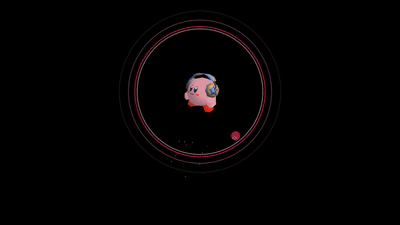

# 🎉 Tiktok simulation falling Ball !

A fun and interactive project developed with Python and Pygame, featuring **bouncing balls**, **particle effects**, **animated GIFs**, and **sound effects**. This simulation offers a dynamic visual and audio experience, perfect for exploring the fundamentals of game and graphical effects development in Python.

## Exemple


## 📖 Table of Contents
1. [About the Project 🚀](#about-the-project)
2. [Features ✨](#features)
3. [Prerequisites 📋](#prerequisites)
4. [Installation & Setup 💻](#installation--setup)
5. [Usage 🎮](#usage)
6. [Learning Outcomes 📚](#learning-outcomes)
7. [License ⚖️](#license)
## 🚀 About the Project<a name="#-about-the-project"></a>

This project simulates a bouncing ball within a circular boundary, enhanced by **particle effects**, **expanding circles**, and an **animated GIF**. When the ball collides with the boundary, a **sound effect** is triggered, synchronized with the animation. Users can **adjust gravity** and **start** or **stop** the simulation using simple keyboard inputs.
## ✨ Features

- **Realistic Physics:** Includes gravity, collision detection, and bounce dynamics.  
- **Particle Effects:** Particles generated at collision points for added visual flair.  
- **Animated GIF:** Integration of a GIF using the Pillow (PIL) library.  
- **Sound Effects:** Played on collisions for an immersive experience.  
- **Expanding Circles:** Circles appear and expand upon impact.  
- **User Controls:** Modify gravity, start the simulation, and exit via keyboard inputs.
## 📋 Prerequisites

- **Python 3.6 or higher**  
- **Pygame**  
- **Pillow (PIL)**  

Make sure these dependencies are installed before running the project.

## 💻 Installation & Setup

1. **Clone the Repository:**
   ```bash
   git clone https://github.com/your-username/cat-dancing-particle-simulation.git
   cd cat-dancing-particle-simulation

2. **(Optional) Create a Virtual Environment:**
   ```bash
   python3 -m venv venv
   source venv/bin/activate
3. **Install Dependencies:**
   ```bash
   pip install -r requirements.txt
## 🎮 Usage

Once the dependencies are installed, run the simulation:
```bash
python main.py
```
**Keyboard Controls:**

- **SPACE:** Start/Resume the simulation
- **Up/Down Arrows:** Increase or decrease gravity  
- **Escape (ESC):** Quit the simulation
## 📚 Learning Outcomes
By developing this project, I was able to:
- **Deepen Pygame Expertise:** Learn the basics of game development and graphical simulations in Python.
- **Audio Handling in Python:** Manage and play sound effects using Pygame's mixer.
- **Integrate Animated GIFs:** Use Pillow (PIL) to handle image animations within Pygame.
- **Experiment with Physics:** Implement gravity, collision detection, and restitution.
## ⚖️ License<a name="#-license"></a>
This project is licensed under the MIT License. You are free to use, modify, and distribute it under the terms of the license.